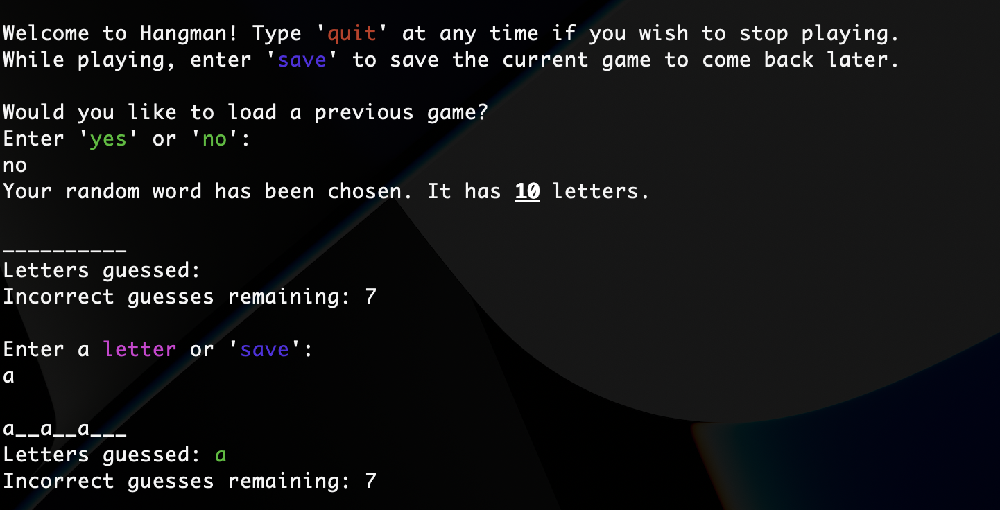

# Ruby Hangman

This is my Ruby implementation of the Hangman. This project is part of the [The Odin Project](https://www.theodinproject.com/lessons/ruby-hangman) curriculum.



[](https://replit.com/@christanr00/rubyhangman)

## Installation

```bash
git clone git@github.com:crobin00/ruby_hangman.git
ruby main.rb
```

## Usage

Try to guess the secret word in 7 moves.

You may save at any time during the game by entering
`save`. A random word sequence will be generated and
you can use that same sequence to load the current
game back.

Enter `quit` at any point during the program to quit.

## To-do

- Add ability to guess full word
- Add ability for user to enter their own filename for
  save file
- Stick figure ascii art
